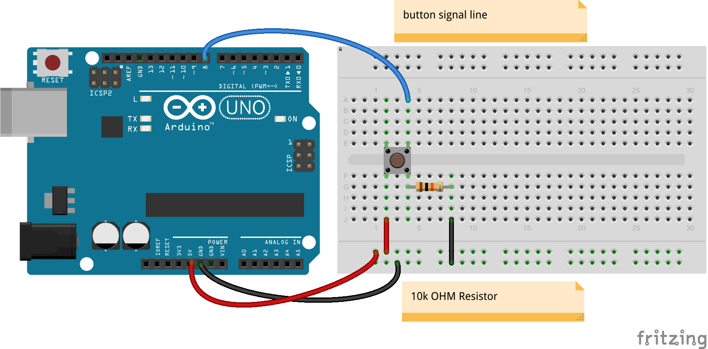

<!--remove-start-->

# Button - Options

<!--remove-end-->


##### Breadboard for "Button - Options"


<br>

Fritzing diagram: [docs/breadboard/button-options.fzz](breadboard/button-options.fzz)

&nbsp;


Run this example from the command line with:
```bash
node eg/button-options.js
```


```javascript
var five = require("johnny-five"),
  board, button;

board = new five.Board();

board.on("ready", function() {

  // Create a new `button` hardware instance
  button = new five.Button({
    board: board,
    pin: 8,
    holdtime: 1000,
    invert: false // Default: "false".  Set to "true" if button is Active-Low
  });

  // Inject the `button` hardware into
  // the Repl instance's context;
  // allows direct command line access
  board.repl.inject({
    button: button
  });

  // Button Event API

  // "down" the button is pressed
  button.on("down", function() {
    console.log("down");
  });

  // "hold" the button is pressed for specified time.
  //        defaults to 500ms (1/2 second)
  //        set
  button.on("hold", function() {
    console.log("hold");
  });

  // "up" the button is released
  button.on("up", function() {
    console.log("up");
  });
});

```


&nbsp;

<!--remove-start-->

## License
Copyright (c) 2012-2014 Rick Waldron <waldron.rick@gmail.com>
Licensed under the MIT license.
Copyright (c) 2015-2021 The Johnny-Five Contributors
Licensed under the MIT license.

<!--remove-end-->
