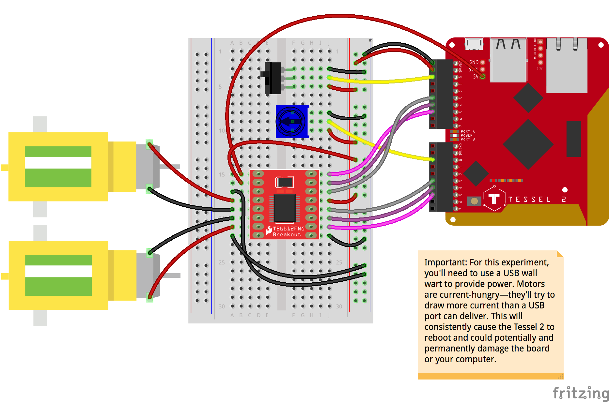

<!--remove-start-->

# Motor - Sparkfun TB6612FNG

<!--remove-end-->


##### Breadboard for "Motor - Sparkfun TB6612FNG"


<br>

Fritzing diagram: [docs/breadboard/motor-TB6612FNG.fzz](breadboard/motor-TB6612FNG.fzz)

&nbsp;


Run this example from the command line with:
```bash
node eg/motor-TB6612FNG.js
```


```javascript
const {Board, Switch, Sensor, Motor} = require("johnny-five");
const Tessel = require("tessel-io");
const board = new Board({
  io: new Tessel()
});

board.on("ready", () => {
  const spdt = new Switch("a0");
  const throttle = new Sensor("b0");

  // See the comments below for more information about
  // the pins shown in this pin array argument.
  const motor = new Motor([ "a5", "a4", "a3" ]);

  spdt.on("open", () => {
    motor.stop().forward(motor.speed());
  });

  spdt.on("close", () => {
    motor.stop().reverse(motor.speed());
  });

  throttle.on("change", () => {
    motor.speed(throttle.value >> 2);
  });
});

```


## Additional Notes
Here's a breakdown of the pins used by these motor drivers, their corresponding Johnny-Five Motor class pin name, and capabilities:
| Control Type/Role | Johnny-Five Motor Pin Name | Breakout Printed Pin |
| ----------------- | -------------------------- | -------------------- |
| PWM               | `pwm`                      | `PWMA` or `PWMB`     |
| Counter Direction | `cdir`                     | `AIN2` or `BIN2`     |
| Direction         | `dir`                      | `AIN1` or `BIN1`     |

&nbsp;

<!--remove-start-->

## License
Copyright (c) 2012-2014 Rick Waldron <waldron.rick@gmail.com>
Licensed under the MIT license.
Copyright (c) 2015-2021 The Johnny-Five Contributors
Licensed under the MIT license.

<!--remove-end-->
